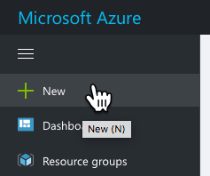
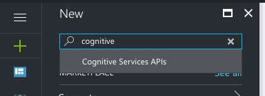
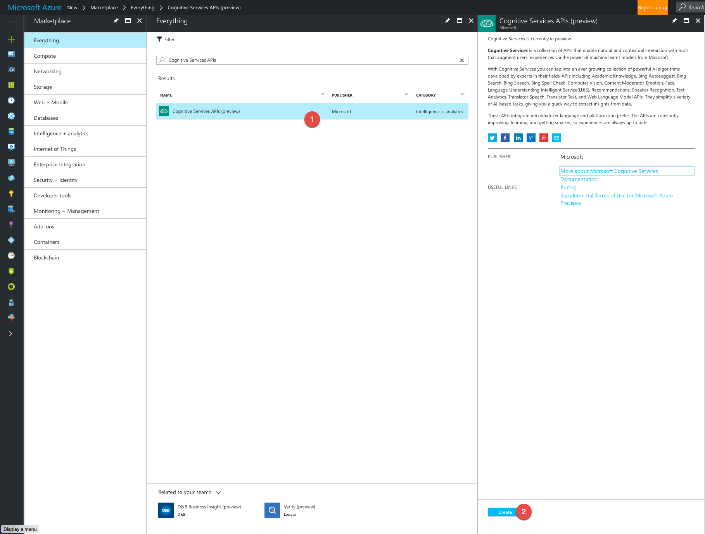
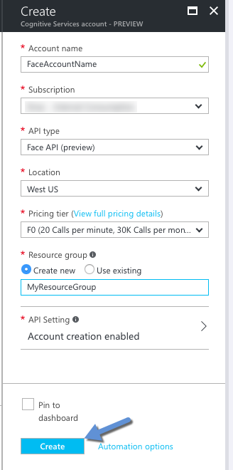
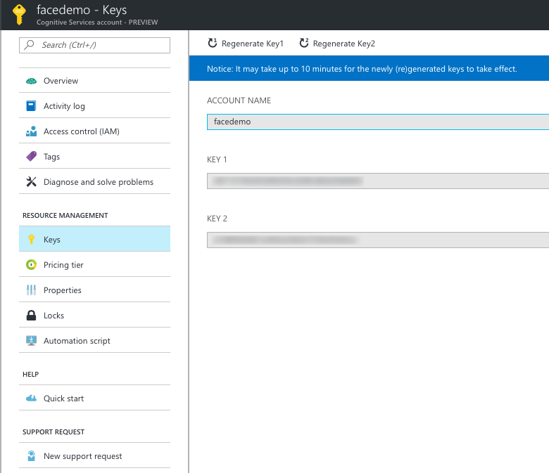

# Getting started

You need to restore all node modules

```cli
npm install
```

or with yarn

```cli
yarn install
```

In the main.js file you need to set the your API key for the Face API.
Look for the line:

```javascript
let facesApi = faces("<insert your api key here>");
```

See below for how to setup the Faces API in Azure and get the key.
Once you've setup the Faces API in Azure and put in the key, you can run it
from CLI by running:

```cli
node main.js
```

Then you can navigate your browser to [http://localhost:3000](http://localhost:3000)


## Azure

Create a new resource in Azure by clicking the `+`sign:



Then search for `Cognitive Services API``



Then select the `Cognitive Services APIs` and click `Create`



Fill out all the details about the service; Account Name, Type (Face API), Location, Pricing, Resource Group and then click Create.



Once resource is created open it and open the Keys and copy the `Key 1`into the JavaScript code in `main.js`

